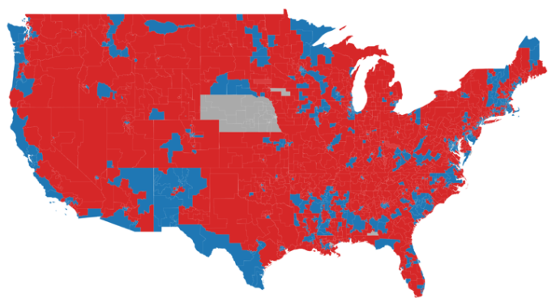
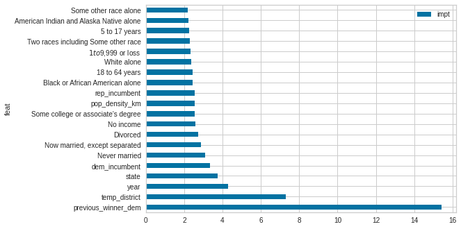
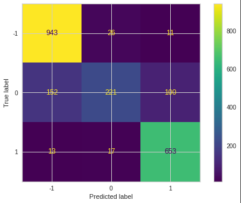

# State Legislature Election Modeling

Credit: [National Conference of State Legislatures](https://www.ncsl.org/research/elections-and-campaigns/district-by-district-state-legislative-control.aspx)

## [Presentation](presentation.pdf)

## Goal

In this project I aim to create models able to predict the outcome of political campaigns for state legislative seats in all 50 states. 

Unlike presidential and other high profile races, contests for state legislative seats largely go unnoticed by voters and polling firms alike. However, while the attention they get may be small, their power over the United States is large. State legislatures decide district boundaries for congressional races and write voting laws. And with critical issues before the Supreme Court, their direct influence over the lives of everyday Americans is likely only just coming into focus.

However, state parties have limited resources with which to contest these seats. It's vital for these parties to know which are most likely to be toss-up elections so they can best allocate these resources.

## Data

I started by collecting [election result data](https://dataverse.harvard.edu/dataset.xhtml?persistentId=doi:10.7910/DVN/3WZFK9) and processing it such that each row represented the details and outcome of one contest. Third party candidates were removed due to their marginal impact and presence in less than a handful of states. Hoping to train my models to gain an accurate understanding of electoral trends, I focused on races between 2012 - the first after 2010 redistricting - and 2016 - the end of the dataset. I added in holdout data from New York's very eventful 2018 election but due to resource constraints couldn't go much further.

I then combined this election data with census demographic data from the American Community Survey's 5-year estimates. Among the thousands of available fields I chose just under 40 that I considered most likely have an impact. These included information on marriage status, income, race, age, and education. I also added in [generic ballot polling averages](https://www.realclearpolitics.com/epolls/other/2012_generic_congressional_vote-3525.html) for each year, calculated right before election day in early November.

## Results

My models indicated that by far the most important factor in who won these elections was the party of the seat's previous winner. That was followed by the district itself, the year, tehe state, and then incumbency status. Only after that did demographics play a role. Interestingly the populations of never married, separated, and divorced people had much more of an impact than the population of married people. Similarly while low income was a relatively strong indicator, high income wasn't.

However, this is only backed up by models that, with these inputs, couldn't pass roughly 85% accuracy. Furthermore, they all had distinct difficulty categorizing toss-ups, peaking at around 47% accurately labeled.

## Conclusion

Election modeling is a challenging field with near endless directions to explore. What's clear from my analysis is that demographics and certain types of political context are useful in understanding how an election might go, it's far from the whole story. With the vast and ever growing ways people's behavior is tracked and analyzed the amount of features that could be considered useful is hard to imagine. While my models definitely passed their benchmark of 46% accuracy, their inability to reliably identify toss-ups indicates there's still much more work to be done.

Further steps include:
* more exhaustive data manipulation including Feature Unions
* expanding the number of years analyzed
* adding demographic data from more sources, especially commercial ones
* analysis of the impact that other simultaneous races may have
